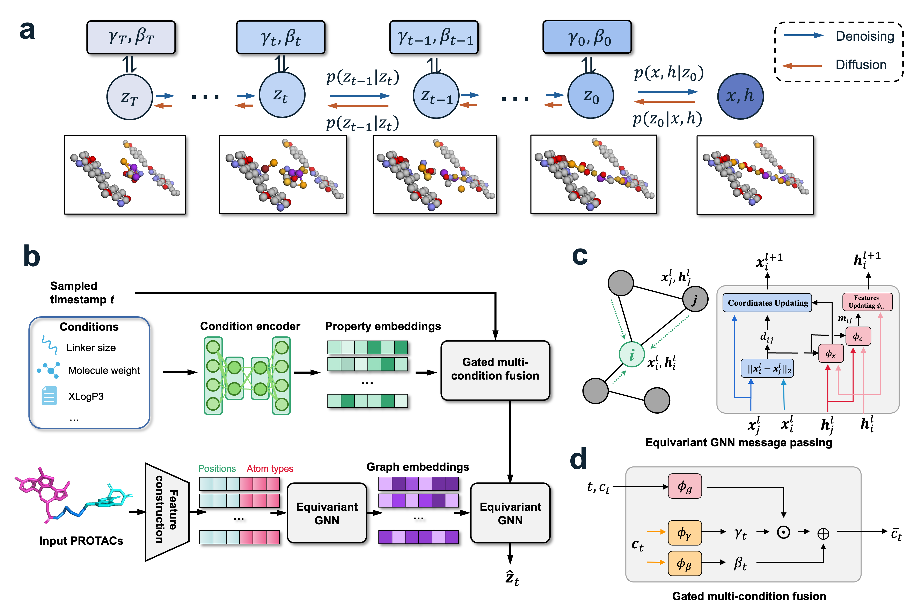

# DesignMaster

  

**DesignMaster** is a diffusion-based generative framework for **structure-guided PROTAC linker design**. The model explicitly incorporates **linker length and physicochemical properties** as controllable conditioning signals, enabling fine-grained and constraint-aware generation of PROTAC molecules.

DesignMaster employs an **E(3)-equivariant graph Transformer** to model three-dimensional molecular structures and introduces a **gated multi-condition fusion module** that injects conditional signals throughout the diffusion denoising process. This design allows the model to generate PROTAC linkers that satisfy both structural compatibility and physicochemical constraints.

Experiments on **PROTAC-DB 2.0** and **PROTAC-DB 3.0** demonstrate that DesignMaster achieves state-of-the-art performance in terms of **validity** and **recovery**, while also producing structures with improved geometric fidelity.

---

# Data and Pretrained Models

The training datasets, pretrained checkpoints, and generated results are publicly available at Zenodo:

**Zenodo repository**

https://zenodo.org/records/18883030

The archive includes:

- **Training datasets**
  - PROTAC-DB 2.0
  - PROTAC-DB 3.0
- **Pretrained model checkpoints**
- **Generated PROTAC samples**

Please download and extract the files before running training or inference.

---

# Repository Structure
